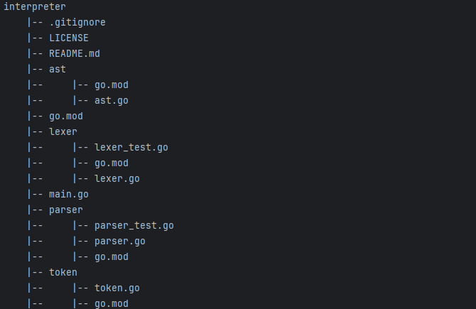

## Project Description ##
The objective of this project is read JSON file and perform data manipulation and print all output in console with like a linux utility output.

For more details kindly refer the "Case Study.pdf" in the project directory.

## Installation Guideline
* install the below packages
>> pip install -r requirements.txt

## Architecture of project
* Python Version: 3.11.9
* Python Files:
  * pyls.py (main function)
  * commandRouter.py
  * patternWriter.py
* JSON File:
  * data.json
* Additional Files
  * README.md
  * requirements.txt
## Data & Function Call Flow:
>> pyls.py (main()->load_From_Json()-> 
>  commandRouter.router()->patternWriter(multiple functions based on operation type)
##

## Project Commit Details:
* https://github.com/sumantas98/JSONToLinuxOptimizer/commits?author=sumantas98&since=2024-08-31&until=2024-09-02

## Test Case Result:
* Test case result has been stored in the 'result.xml' file for future reference. The below command is required to generate the testcases along with report file.
>> pytest testcases/test_pyls.py --junitxml=results.xml
> 
* additional test cases for initial command.
  >> python -m pyls tree
>> Output : 
> 

